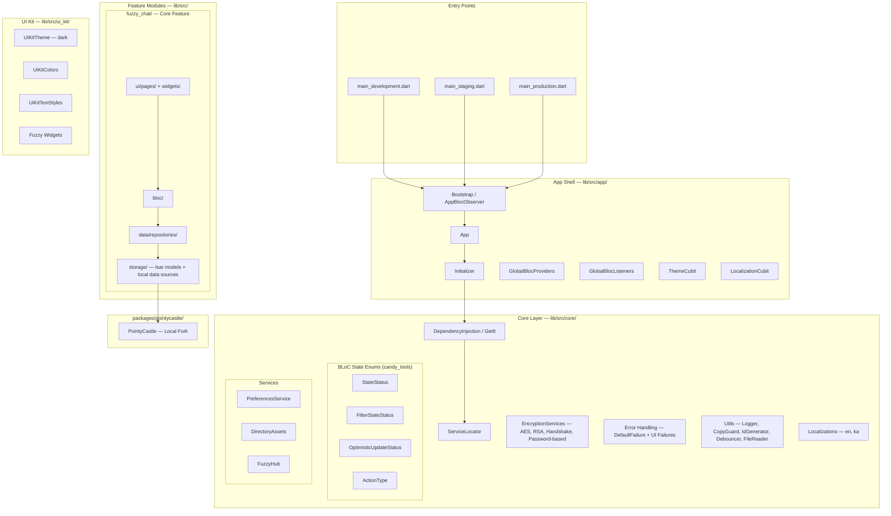
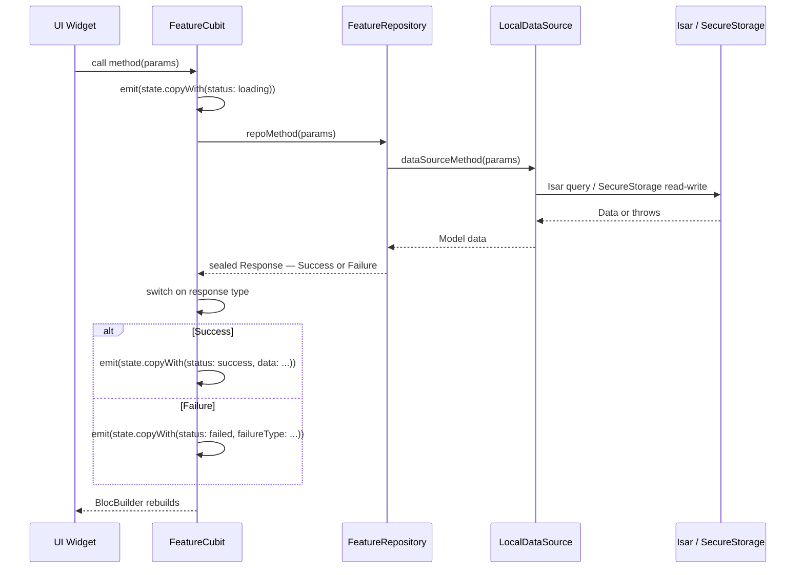

# Fuzzy Chat — Architecture & Standards Guide

> This is the canonical, production-grade architecture and standards document for **Fuzzy Chat**. All AI personas MUST adhere to these rules without exception. This is the single source of truth for "how we build things."

---

## 1. High-Level System Design

### Critical Context: Fuzzy Chat is 100% Offline

Fuzzy Chat has **NO remote API, NO HTTP client, NO server connectivity**. All data lives on-device. The "network" is the user manually copy-pasting encrypted text or sharing encrypted files via external channels.

### Visual Map — System Architecture


### Data Flow — Feature Operation Lifecycle


---

## 2. Directory Structure & Module Responsibilities

```
fuzzy_chat/
├── lib/
│   ├── main_development.dart          # Flavor entry points
│   ├── main_staging.dart
│   ├── main_production.dart
│   └── src/
│       ├── src.dart                    # Root barrel
│       ├── app/                        # App Shell: Routing, Theme, Globals, Init
│       ├── core/                       # Core: DI, Crypto, Errors, Services, Utils
│       ├── fuzzy_chat/                 # Core feature: chat, encryption, handshake
│       ├── fuzzy_auth/                 # Auth feature: local user authentication
│       ├── fuzzy_basics/               # Standalone encryption tool
│       └── ui_kit/                     # Design System (in-tree, not a package)
├── packages/
│   └── pointycastle/                   # Local cryptography fork
└── scripts/                            # Python utility scripts
```

---

## 3. Feature Folder Structure (Canonical Pattern)

Every feature module MUST follow this structure. This is non-negotiable.

### 3.1. Layers within a Feature (`lib/src/<feature_name>/`)
-   **`data/models/`**: Plain Dart data classes. Naming: `<Name>Data` for domain models.
-   **`data/repositories/`**: Facade over local data sources. **MUST** catch all exceptions and return a Sealed Class response.
-   **`storage/`**: 
    -   `storage_models/`: Isar collection classes (with `.g.dart` generated files).
    -   `local_data_sources/`: Direct Isar/SecureStorage access. Service Locator (`sl.get()`) is permitted here.
-   **`bloc/`**: Cubits and their immutable State classes. Takes repository via constructor injection. State file uses `part of`.
-   **`ui/`**: `pages/` (route destinations) and `widgets/` (feature-specific widgets).

### 3.2. Barrel Files & `./exp.sh` (MANDATORY)
Every directory MUST have a barrel file (`<dir_name>.dart`) that exports its children. After creating any new `.dart` files, the user **MUST** be reminded to run `./exp.sh` to automatically update this entire barrel chain. Failure to do so will result in compilation errors.

---

## 4. Architectural Patterns & Rules

### 4.1. BLoC/Cubit & Repository Contract
-   **Repositories NEVER throw exceptions.** They return Sealed Classes (`Success | Failure`). This is the most important rule.
-   **Cubits NEVER use `try/catch`.** They use exhaustive `switch` on the sealed response.
-   **State MUST be immutable.** Use `copyWith`.
-   State status is tracked via `StateStatus` enum (`initial`, `loading`, `success`, `failed`).

### 4.2. Dependency Injection (GetIt)
-   **Constructor Injection is MANDATORY** for Repositories and Cubits.
-   **Service Locator (`sl.get<T>()`) is ONLY permitted** in the `local_data_sources/` layer (for DB access) and at the top level when providing a BLoC. It is forbidden in Widgets, Repositories, and Cubits.

### 4.3. UI Kit & Theming
-   **NEVER** use `Color()`, `Colors.`, `TextStyle()`, or hardcoded numbers for spacing/padding.
-   **ALWAYS** use theme extensions from the `BuildContext`: `context.uiColors`, `context.uiTextStyles`.
-   **ALWAYS** prefer widgets from `ui_kit/` (`FuzzyScaffold`, `FuzzyButton`, `FuzzyHeader`) over native Flutter widgets.

### 4.4. Error Handling Protocol (Offline)
1.  **Local Data Source Level:** Data sources interact with Isar/SecureStorage. They may let storage exceptions bubble up.
2.  **Repository Level:** The repository wraps the data source call in a `try/catch` block. It catches ALL exceptions and translates them into a `Failure` object within its sealed response.
3.  **Cubit Level:** The cubit receives the `Failure` object and maps it to a `StateStatus.failed` state, passing along a specific `FailureType` enum.
4.  **UI Level:** The UI uses status builders to react to `StateStatus.failed` and display appropriate error feedback.

### 4.5. Offline-Only Rule (CRITICAL)
-   **NEVER** introduce HTTP clients, API calls, or remote data sources.
-   **NEVER** add dependencies that require network connectivity.
-   All data operations are local: Isar DB, SecureStorage, SharedPreferences, local file system.

---

## 5. Cryptography Stack

The app's core value is its cryptography. The crypto layer lives in `lib/src/core/encryption_services/`:

| Service | Purpose |
|---------|---------|
| `AesService` | Symmetric encryption for messages and files |
| `RsaService` | Asymmetric key generation and encryption |
| `HandshakeService` | Key exchange protocol (invitation/acceptance) |
| `PasswordBasedEncryptionService` | Password-derived key encryption |

All crypto operations use `packages/pointycastle/` (a local fork of PointyCastle).

---

## 6. Scripts & Code Generation

| Script | Purpose | Usage |
|--------|---------|-------|
| `./exp.sh` | Regenerate all barrel files | Run after creating any new `.dart` file |
| `./loc.sh` | Add localization entries | `./loc.sh "key||en||English text"` |
| `./m.sh` | Merge file contents for AI context | `./m.sh lib/src/fuzzy_chat [-c]` |
| `./buildrunner.sh` | Run build_runner for Isar schemas | After modifying Isar models |

---

## 7. Linter & Formatting
The project uses `very_good_analysis` ^5.1.0 with disabled rules for practicality (80-char line limit, cascade invocations, etc.). The [REVIEWER] persona must run `fvm flutter analyze` and `fvm dart format --set-exit-if-changed .` as part of its process.
