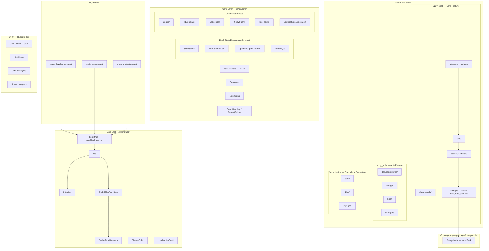

# Fuzzy Chat — Project Context

> This document provides a complete understanding of the project without looking at the code. It is maintained by the [DOCUMENTER] persona.

---

## 1. Core Overview

| Field              | Value |
|--------------------|-------|
| **Project Name**   | Fuzzy Chat |
| **Package Name**   | `fuzzy_chat` |
| **Target Platforms**| Android, iOS, macOS, Windows, Web |
| **SDK Constraint** | `>=3.0.0 <4.0.0` |
| **Flutter Version**| `3.24.3` (managed via FVM) |
| **Target Audience**| Privacy-focused individuals, journalists, lawyers, executives, anyone needing offline-first secure messaging |
| **Core Value Proposition** | A personal, offline encryption system disguised as a chat interface. Messages are "fuzzed" (encrypted) locally and can be shared across any public channel. Only the paired recipient can "unfuzz" (decrypt). Zero servers, zero metadata, zero tracking. |

## 2. Technical Stack

### Dependencies

| Package                | Version   | Purpose |
|------------------------|-----------|---------|
| `bloc`                 | ^8.1.2    | State management core |
| `flutter_bloc`         | ^8.1.3    | Flutter BLoC integration |
| `get_it`               | ^8.0.0    | Service locator / DI |
| `go_router`            | ^13.0.1   | Routing (declared but not yet wired — uses Navigator-based routing currently) |
| `isar`                 | ^3.1.0+1  | Local NoSQL database |
| `isar_flutter_libs`    | ^3.1.0+1  | Isar native bindings |
| `flutter_secure_storage` | ^9.2.2  | Encrypted key storage |
| `shared_preferences`   | ^2.3.2    | Lightweight preferences |
| `pointycastle`         | local     | Cryptography library (local package in `packages/pointycastle`) |
| `path_provider`        | ^2.0.11   | File system paths |
| `path`                 | ^1.9.0    | Path manipulation |
| `uuid`                 | ^4.5.1    | Unique ID generation |
| `file_picker`          | ^8.0.5    | File selection |
| `desktop_drop`         | ^0.6.0    | Desktop drag-and-drop |
| `flutter_dropzone`     | ^4.0.0    | Web drag-and-drop |
| `share_plus`           | ^10.1.2   | Native share sheet |
| `url_launcher`         | ^6.3.1    | URL launching |
| `permission_handler`   | ^10.0.0   | Runtime permissions |
| `vibration`            | ^2.0.1    | Haptic feedback |
| `logger`               | ^2.4.0    | Debug logging |
| `intl`                 | ^0.19.0   | Internationalization |

### Dev Dependencies

| Package                | Version   | Purpose |
|------------------------|-----------|---------|
| `very_good_analysis`   | ^5.1.0    | Linting rules |
| `bloc_test`            | ^9.1.4    | BLoC/Cubit testing |
| `mocktail`             | ^1.0.0    | Mocking framework |
| `build_runner`         | ^2.0.0    | Code generation runner |
| `isar_generator`       | ^3.1.0+1  | Isar schema generation |
| `flutter_launcher_icons` | ^0.13.1 | App icon generation |

## 3. High-Level Architecture

## 4. Key Architectural Differences from General Guide

The general architecture guide (`.agents/general_guide/flutter_architecture.md`) is written for a typical client-server Flutter app. Fuzzy Chat deviates in these critical ways:

| Aspect | General Guide | Fuzzy Chat Reality |
|--------|--------------|-------------------|
| **Network Layer** | HTTP Client stack with Dio, interceptors, API endpoints | **NONE.** Fully offline. No HTTP clients, no remote API. |
| **Data Sources** | Remote data sources hitting APIs | **Local only.** Isar DB + `flutter_secure_storage` + `shared_preferences` |
| **Repository Pattern** | Catches HTTP exceptions, returns sealed responses | Catches **local storage** exceptions. Same sealed pattern applies. |
| **Routing** | GoRouter with named routes | `go_router` is a dependency but **not yet wired**. Currently uses `Navigator.push` via `MaterialApp` |
| **UI Kit** | Separate `packages/ui_kit/` package | UI Kit lives **inside** `lib/src/ui_kit/` (not a separate package) |
| **Code Generators** | Mason bricks for feature scaffolding | `code_generators/bricks/` directory exists but may not have all referenced bricks |

## 5. Supported Locales

- `en` — English
- `ka` — Georgian (ქართული)
