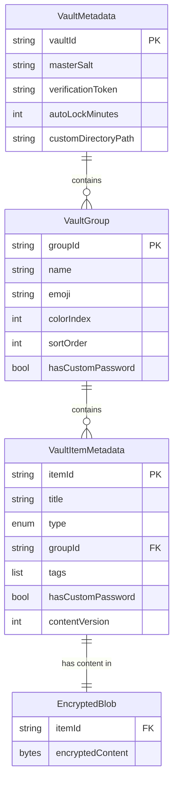

# Fuzzy Vault — Data Models Specification

> **Document:** Data model definitions for all Fuzzy Vault entities
> **Status:** PLANNING

---

## 1. Domain Models (`data/models/`)

### 1.1 VaultItemType (enum)

```dart
enum VaultItemType {
  password,
  note,
}
```

### 1.2 VaultGroup

```dart
class VaultGroupData {
  final String id;              // UUID
  final String name;            // Display name
  final String emoji;           // Emoji icon (e.g., "🔑", "📝")
  final int colorIndex;         // Index into a predefined color palette
  final int sortOrder;          // For manual reordering
  final bool hasCustomPassword; // Whether this group requires an additional password
  final DateTime createdAt;
  final DateTime updatedAt;

  static const generalGroupId = 'general';
  static const generalGroupName = 'General';
}
```

### 1.3 VaultItemMetadata

Stored in Isar for fast indexing/search. **Never encrypted** — this is the searchable index.

```dart
class VaultItemMetadata {
  final String id;              // UUID
  final String title;           // Item title (searchable)
  final VaultItemType type;     // password or note
  final String groupId;         // FK to VaultGroupData
  final List<String> tags;      // Optional tags for search
  final bool isFavorite;        // Favorite flag
  final bool hasCustomPassword; // Whether this specific item has a custom password
  final DateTime createdAt;
  final DateTime updatedAt;
  final int contentVersion;     // Incremented on each content save (for conflict resolution)
}
```

### 1.4 VaultPasswordContent

The decrypted content of a password item. Encrypted before storage.

```dart
class VaultPasswordContent {
  final String username;
  final String password;
  final String? url;
  final String? notes;           // Plain text notes attached to the password
  final Map<String, String> customFields; // Optional key-value pairs (e.g., "Security Question": "...")
}
```

### 1.5 VaultNoteContent

The decrypted content of a note item. Encrypted before storage.

```dart
class VaultNoteContent {
  final List<Map<String, dynamic>> delta; // Rich text delta format (Quill-like)
  final String plainText;                  // Plain text extraction for search preview
}
```

### 1.6 VaultItem (composite)

Full item = metadata + decrypted content. Only assembled when user opens an item.

```dart
class VaultItem {
  final VaultItemMetadata metadata;
  final VaultPasswordContent? passwordContent; // Non-null when type == password
  final VaultNoteContent? noteContent;          // Non-null when type == note
}
```

### 1.7 VaultMetadata (singleton)

Global vault metadata. Stored encrypted on disk.

```dart
class VaultMetadata {
  final String vaultId;          // UUID — unique per vault instance
  final String verificationToken; // Encrypted known token for password verification
  final String masterSalt;        // Base64-encoded salt for master key derivation
  final DateTime createdAt;
  final DateTime lastUnlockedAt;
  final int autoLockMinutes;      // 0 = immediate, -1 = never
  final String? customDirectoryPath; // Optional additional directory
}
```

---

## 2. Isar Storage Models (`storage/storage_models/`)

### 2.1 StoredVaultItem

```dart
@collection
class StoredVaultItem {
  Id id = Isar.autoIncrement;

  @Index(unique: true)
  late String itemId;           // UUID

  @Index()
  late String title;            // For search

  @Index()
  late String groupId;          // FK

  @Enumerated(EnumType.ordinal)
  late VaultItemType type;

  late List<String> tags;

  late bool isFavorite;

  late bool hasCustomPassword;

  late DateTime createdAt;
  late DateTime updatedAt;
  late int contentVersion;

  // Encrypted content is NOT stored in Isar.
  // It lives as a file: {vaultDir}/{itemId}.vault
}
```

### 2.2 StoredVaultGroup

```dart
@collection
class StoredVaultGroup {
  Id id = Isar.autoIncrement;

  @Index(unique: true)
  late String groupId;          // UUID

  late String name;
  late String emoji;
  late int colorIndex;
  late int sortOrder;
  late bool hasCustomPassword;
  late DateTime createdAt;
  late DateTime updatedAt;
}
```

### 2.3 StoredVaultMetadata

```dart
@collection
class StoredVaultMetadata {
  Id id = Isar.autoIncrement;

  late String vaultId;
  late String verificationTokenBase64; // Encrypted verification token
  late String masterSaltBase64;
  late DateTime createdAt;
  late DateTime lastUnlockedAt;
  late int autoLockMinutes;
  late String? customDirectoryPath;
}
```

---

## 3. File System Storage

Encrypted content is stored as binary files on the file system, **not** in Isar. This separation provides:
- **Better performance**: Large encrypted blobs don't bloat the Isar database.
- **Atomic writes**: File rename is atomic on all target platforms.
- **Multi-directory support**: Easy to scan additional directories for vault files.

### Directory structure:

```
{appSupportDir}/fuzzy_vault/
├── vault.meta                    # Encrypted VaultMetadata
├── journal.wal                   # Write-ahead log
├── items/
│   ├── {itemId_1}.vault          # Encrypted item content
│   ├── {itemId_2}.vault
│   └── ...
├── .tmp/                         # Temp files for atomic writes
└── .conflicts/                   # Conflicting versions from multi-dir merge
    └── {itemId}_{timestamp}.vault
```

### Custom directory (if configured):

```
{customDir}/fuzzy_vault/
├── items/
│   ├── {itemId_x}.vault
│   └── ...
```

---

## 4. Sealed Response Types

Following the project's repository pattern:

```dart
sealed class VaultResponse<T> {
  const VaultResponse();
}

class VaultSuccess<T> extends VaultResponse<T> {
  final T data;
  const VaultSuccess(this.data);
}

class VaultFailure<T> extends VaultResponse<T> {
  final VaultFailureType type;
  final String? message;
  const VaultFailure(this.type, {this.message});
}
```

### VaultFailureType enum:

```dart
enum VaultFailureType {
  // Auth failures
  incorrectMasterPassword,
  incorrectCustomPassword,
  weakPassword,
  vaultNotInitialized,
  vaultAlreadyExists,

  // CRUD failures
  itemNotFound,
  groupNotFound,
  duplicateItem,
  generalGroupUndeletable,

  // Storage failures
  storageReadError,
  storageWriteError,
  fileCorrupted,
  decryptionFailed,

  // Export/Import failures
  exportFailed,
  importFailed,
  invalidExportFile,
  exportPasswordIncorrect,

  // Directory failures
  directoryNotFound,
  directoryPermissionDenied,
  directoryReadError,

  // General
  unknown,
}
```

---

## 5. Relationships Diagram


