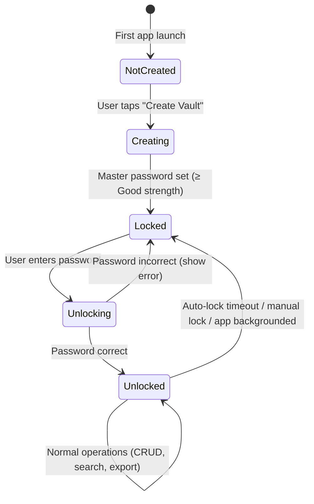
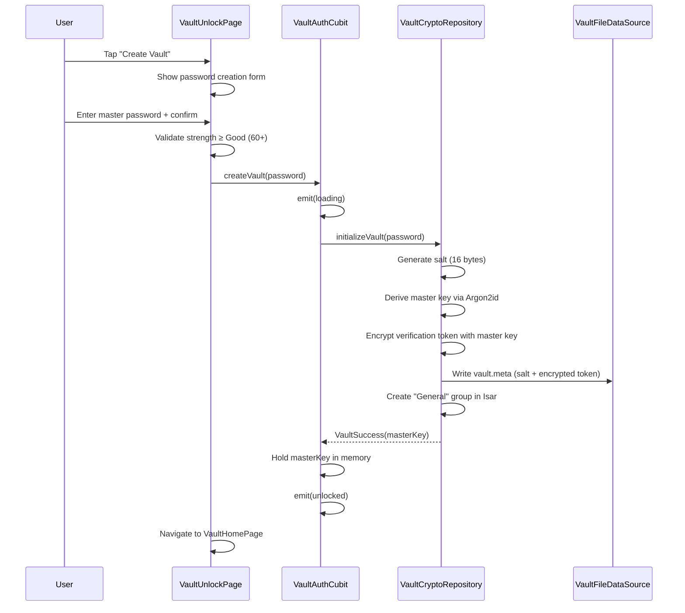
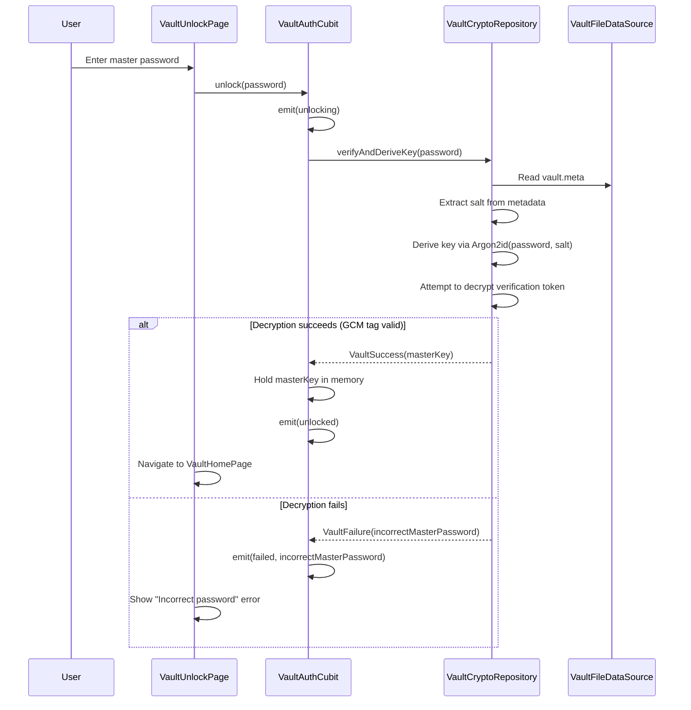
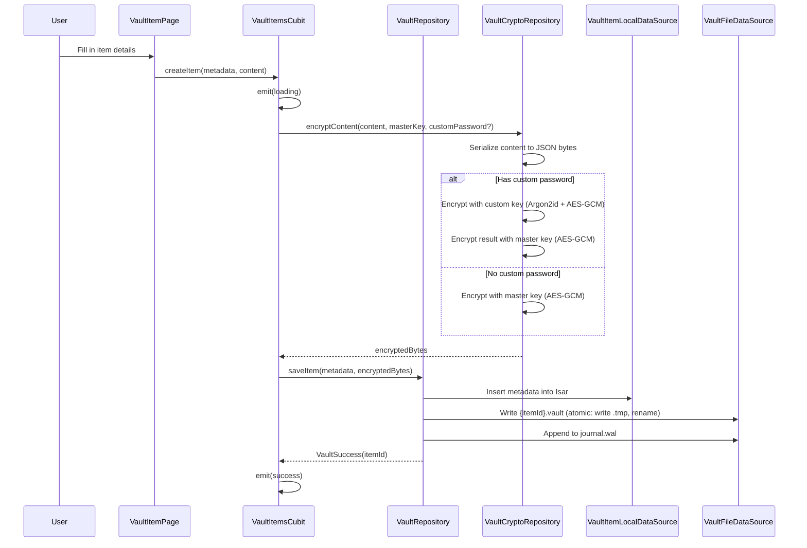
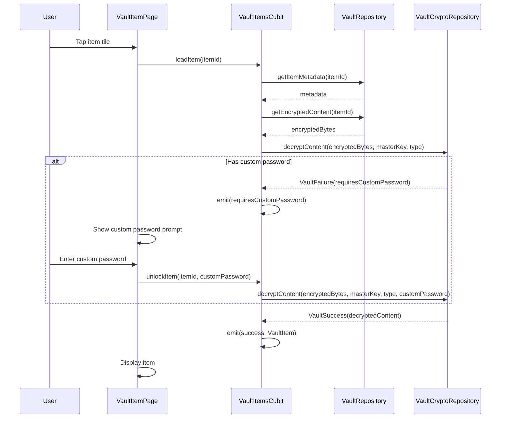
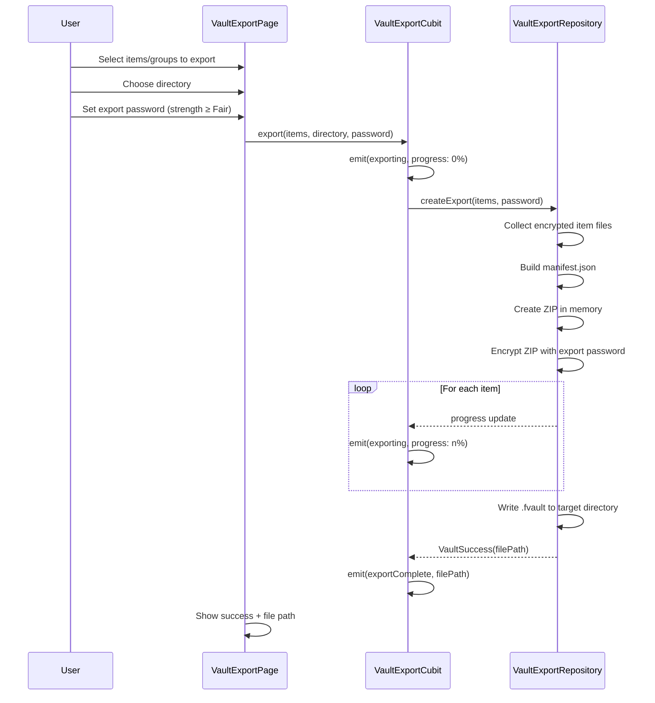
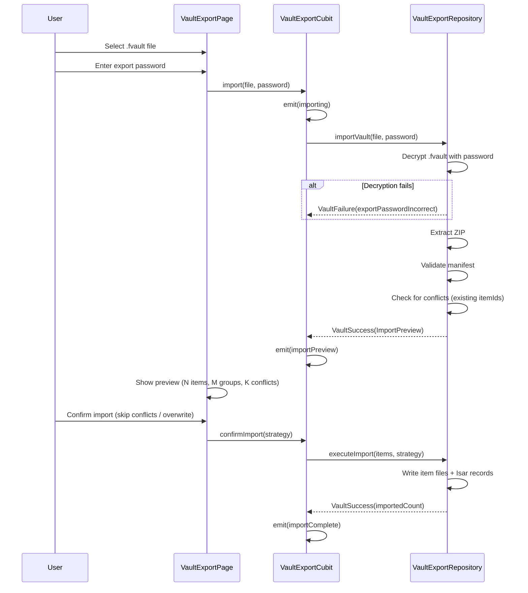

# Fuzzy Vault — Business Logic & User Flows

> **Document:** Detailed user flows, state machines, and business rules
> **Status:** PLANNING

---

## 1. Vault Lifecycle State Machine



### State definitions:

| State | Description | UI |
|-------|-------------|-----|
| `NotCreated` | No vault exists yet. No metadata file. | Show "Create Vault" setup page |
| `Locked` | Vault exists but master key not in memory. | Show unlock page with password field |
| `Unlocking` | Deriving key from password (Argon2id is slow — ~500ms). | Show loading indicator |
| `Unlocked` | Master key in memory. Full access to vault. | Show vault home page |

---

## 2. Vault Creation Flow



---

## 3. Vault Unlock Flow



---

## 4. Item CRUD Flow

### 4.1 Create Item (Password or Note)



### 4.2 Read Item



### 4.3 Update Item

Same as create, but:
1. Increment `contentVersion`.
2. Write new `.vault` file to `.tmp/`, rename over old one.
3. Update Isar metadata.
4. Journal entry: `UPDATE {itemId} v{version}`.

### 4.4 Delete Item

1. Mark as deleted in journal: `DELETE {itemId}`.
2. Remove from Isar.
3. Delete `.vault` file.
4. If item has custom password, no additional auth needed (master password sufficient for deletion).

---

## 5. Search & Filter Flow

### Search implementation:
1. **Isar full-text search** on `title` and `tags` fields.
2. Search is performed on **plaintext metadata only** — we never decrypt all items to search content.
3. Results are instant (Isar indexed queries).

### Filter options:
- By group
- By type (passwords / notes)
- By tag
- Recently modified (last 24h, 7d, 30d)
- Favorites (planned: add `isFavorite` flag to metadata)

### Sort options:
- Alphabetical (A-Z, Z-A)
- Date created (newest/oldest)
- Date modified (newest/oldest)
- Custom (manual drag-and-drop within group)

---

## 6. Group Management

### Create group:
1. User provides: name, emoji, optional custom password.
2. If custom password: validate strength, store password hash indicator (encrypted with master key).
3. Insert into Isar.

### Delete group:
1. **"General" group cannot be deleted.**
2. All items in the deleted group are moved to "General".
3. If group had a custom password, items lose their custom password protection (re-encrypted with master key only).

### Rename/edit group:
1. Update Isar record.
2. If changing custom password: re-encrypt all items in the group with the new key.

### Group-level copy/export:
1. User can select a group → "Copy All Passwords" → all password entries in the group are copied to clipboard as formatted text.
2. User can select a group → "Export Group" → creates an encrypted `.fvault` file with just that group's items.

---

## 7. Auto-Save & Durability (Notes)

### Auto-save flow:
```
User types → 500ms debounce → serialize delta → encrypt → 
write to .tmp/{itemId}.vault.tmp → rename to items/{itemId}.vault →
journal: SAVE {itemId} v{n} → update Isar updatedAt + contentVersion
```

### Crash recovery:
1. On vault open, check `journal.wal`.
2. For each incomplete entry:
   - `SAVE`: Check if `.tmp` file exists → rename to items/ (the save was written but rename didn't complete).
   - `DELETE`: Check if item file still exists → delete it.
   - `UPDATE`: Same as SAVE.
3. Mark journal entries as replayed.
4. Truncate journal after successful recovery.

### Data integrity check:
- On each item open, verify GCM authentication tag.
- If decryption fails (corruption), check `.conflicts/` for backup versions.
- Show error to user with option to "Recover from backup" if a conflict copy exists.

---

## 8. Export/Import Flow

### Export:


### Import:


---

## 9. Multi-Directory Merge Flow

On vault unlock:

```
1. Scan baseDir/fuzzy_vault/items/ → collect {itemId: modifiedDate} map
2. If customDir configured:
   a. Scan customDir/fuzzy_vault/items/ → collect same map
   b. For each itemId in customDir:
      - If not in baseDir → copy to baseDir, add to Isar
      - If in baseDir AND customDir is newer → 
        move baseDir version to .conflicts/, copy customDir version to baseDir
      - If in baseDir AND baseDir is newer → skip (or copy base to custom if writable)
3. Load all metadata from Isar
4. Verify itemIds in Isar match files on disk (orphan cleanup)
```

---

## 10. Clipboard Operations

### Copy password:
1. User taps copy icon on a password entry.
2. If item requires custom password and is not yet unlocked → prompt.
3. Decrypt password field only (not entire item).
4. Copy to system clipboard.
5. **Auto-clear clipboard after 30 seconds** (configurable).
6. Show snackbar: "Password copied. Clipboard clears in 30s."

### Copy all passwords in group:
1. User selects group → "Copy All".
2. Format as plain text:
   ```
   --- Group: Work ---
   Title: GitHub
   Username: user@example.com
   Password: ********
   
   Title: AWS Console
   Username: admin
   Password: ********
   ```
3. Copy to clipboard.
4. Auto-clear after 60 seconds.

---

## 11. Password Generator (Bonus)

Built-in generator accessible from password creation form:

| Option | Default |
|--------|---------|
| Length | 20 |
| Uppercase | ✅ |
| Lowercase | ✅ |
| Digits | ✅ |
| Symbols | ✅ |
| Exclude ambiguous (0/O, l/1) | ❌ |

Generated using `SecureBytesGeneration` (already exists in `core/utils/`).

---

## 12. Master Password Change Flow

1. User enters current master password → verify.
2. User enters new master password → validate strength ≥ Good.
3. **Re-encryption sweep**: 
   - For each item: decrypt with old key → re-encrypt with new key → atomic write.
   - Progress indicator shown.
4. Update vault.meta with new salt and verification token.
5. This is an **all-or-nothing** operation: if it fails midway, rollback using journal.

> **Risk mitigation**: Before starting, create a full backup of all `.vault` files in `.backup_{timestamp}/`. If the operation completes, delete the backup. If it fails, restore from backup.
