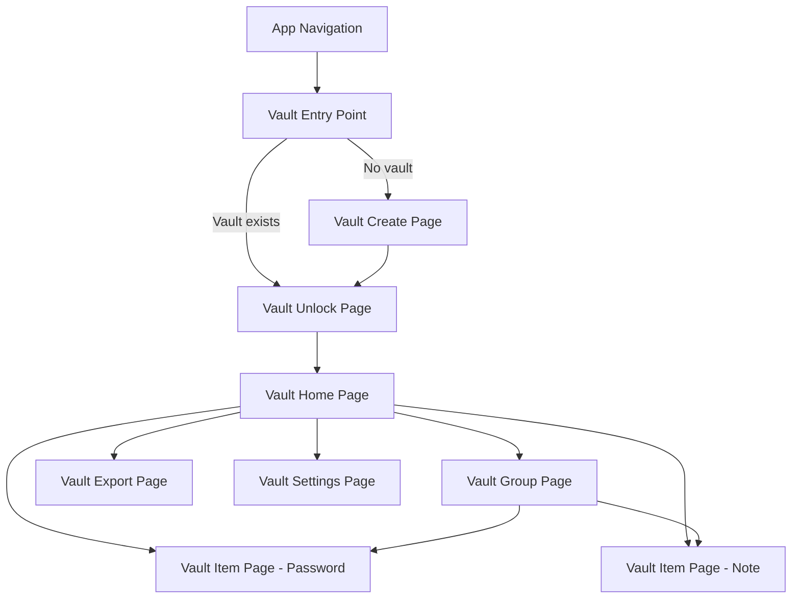

# Fuzzy Vault — UI/UX Specification

> **Document:** Page layouts, widget specs, interactions, and user experience details
> **Status:** PLANNING

---

## 1. Page Map



---

## 2. Vault Create Page (`vault_create_page/`)

### Purpose
First-time vault setup. User creates their master password.

### Layout
```
┌──────────────────────────────────────┐
│  FuzzyHeader: "Create Your Vault"    │
│                                      │
│  ┌──────────────────────────────┐    │
│  │  🔐 Icon / Illustration     │    │
│  └──────────────────────────────┘    │
│                                      │
│  "Your vault encrypts all passwords  │
│   and notes locally on your device.  │
│   Choose a strong master password."  │
│                                      │
│  ┌──────────────────────────────┐    │
│  │ Master Password              │    │
│  │ [••••••••••••••••]  👁       │    │
│  └──────────────────────────────┘    │
│                                      │
│  ┌──────────────────────────────┐    │
│  │ ████████████░░░░░  Good 72%  │    │ ← Password Strength Indicator
│  │ ✓ Length  ✓ Upper  ✓ Lower   │    │
│  │ ✓ Digits  ✗ Symbols          │    │
│  └──────────────────────────────┘    │
│                                      │
│  ┌──────────────────────────────┐    │
│  │ Confirm Password             │    │
│  │ [••••••••••••••••]  👁       │    │
│  └──────────────────────────────┘    │
│                                      │
│  ⚠ "This password cannot be reset.  │
│     If you forget it, your data      │
│     will be permanently lost."       │
│                                      │
│  ┌──────────────────────────────┐    │
│  │      Create Vault  →         │    │ ← FuzzyButton (disabled until strength ≥ Good + match)
│  └──────────────────────────────┘    │
└──────────────────────────────────────┘
```

### Interactions
- Password visibility toggle (eye icon).
- Real-time strength meter updates as user types.
- "Create Vault" button enabled only when: strength ≥ Good (60+) AND passwords match.
- On create: loading overlay → navigate to Vault Home.

---

## 3. Vault Unlock Page (`vault_unlock_page/`)

### Layout
```
┌──────────────────────────────────────┐
│  FuzzyHeader: "Unlock Vault"         │
│                                      │
│  ┌──────────────────────────────┐    │
│  │  🔒 Lock Icon (animated)    │    │
│  └──────────────────────────────┘    │
│                                      │
│  ┌──────────────────────────────┐    │
│  │ Master Password              │    │
│  │ [••••••••••••••••]  👁       │    │
│  └──────────────────────────────┘    │
│                                      │
│  ❌ "Incorrect password" (if error) │
│                                      │
│  ┌──────────────────────────────┐    │
│  │        Unlock  🔓            │    │
│  └──────────────────────────────┘    │
│                                      │
│  "Forgot password? Your data is     │
│   encrypted and cannot be recovered."│
└──────────────────────────────────────┘
```

### Interactions
- Submit on Enter key press.
- Loading state during Argon2id derivation (~500ms).
- Lock icon animates to unlocked on success.
- Shake animation on incorrect password.
- After 5 consecutive failures: 30-second lockout with countdown.

---

## 4. Vault Home Page (`vault_home_page/`)

### Layout
```
┌──────────────────────────────────────┐
│  FuzzyHeader: "Vault"    🔍  ⚙  🔒  │ ← Search, Settings, Lock buttons
│                                      │
│  ┌──────────────────────────────┐    │
│  │ 🔍 Search passwords & notes  │    │ ← VaultSearchBar
│  └──────────────────────────────┘    │
│                                      │
│  ── Groups ──────────────────────    │
│  ┌────┐  ┌────┐  ┌────┐  ┌────┐    │
│  │ 📁 │  │ 💼 │  │ 🏠 │  │ ➕ │    │ ← Horizontal scrollable group chips
│  │Gen.│  │Work│  │Home│  │Add │    │
│  │(12)│  │ (5)│  │ (3)│  │    │    │
│  └────┘  └────┘  └────┘  └────┘    │
│                                      │
│  ── Recent ──────────────── See All  │
│  ┌──────────────────────────────┐    │
│  │ 🔑  GitHub          Work     │    │
│  │     user@email.com  2h ago  📋│    │ ← Tap to open, 📋 = quick copy
│  ├──────────────────────────────┤    │
│  │ 📝  Meeting Notes    General │    │
│  │     "Discussed budget..."  1d│    │
│  ├──────────────────────────────┤    │
│  │ 🔑  AWS Console      Work   │    │
│  │     admin            3d  📋 │    │
│  ├──────────────────────────────┤    │
│  │ 📝  Project Ideas    Home   │    │
│  │     "1. App redesign..." 5d │    │
│  └──────────────────────────────┘    │
│                                      │
│              ┌─────────┐             │
│              │  ➕ Add  │             │ ← FAB: shows bottom sheet (Password / Note)
│              └─────────┘             │
└──────────────────────────────────────┘
```

### Interactions
- **Group chips**: Tap to navigate to VaultGroupPage filtered to that group.
- **Item tiles**: Tap to open VaultItemPage. Swipe left for delete.
- **Copy button** (📋): One-tap password copy with clipboard auto-clear.
- **Search**: Inline results replace the item list as user types.
- **Lock button** (🔒): Immediately locks vault and returns to unlock page.
- **FAB (+)**: Bottom sheet with two options: "New Password" / "New Note".

---

## 5. Vault Group Page (`vault_group_page/`)

### Layout
```
┌──────────────────────────────────────┐
│  ← Back   "Work" 💼   ⋮ (menu)      │
│                                      │
│  ┌──────────────────────────────┐    │
│  │ 🔍 Search in group           │    │
│  └──────────────────────────────┘    │
│                                      │
│  🔑  5 passwords  ·  📝  2 notes    │
│                                      │
│  ┌──────────────────────────────┐    │
│  │ 🔑  GitHub                   │    │
│  │     user@email.com       📋 │    │
│  ├──────────────────────────────┤    │
│  │ 🔑  AWS Console              │    │
│  │     admin                📋 │    │
│  ├──────────────────────────────┤    │
│  │ 🔑  Jira                    │    │
│  │     john.doe             📋 │    │
│  ├──────────────────────────────┤    │
│  │ 📝  Login Recovery Codes    │    │
│  │     "GitHub: XXXX-XXXX..."  │    │
│  ├──────────────────────────────┤    │
│  │ 📝  Server SSH Keys         │    │
│  │     "Production: ssh-rsa..."│    │
│  └──────────────────────────────┘    │
│                                      │
│  ┌──────────────────────────────┐    │
│  │     ➕ Add to "Work"         │    │
│  └──────────────────────────────┘    │
└──────────────────────────────────────┘
```

### Menu (⋮) options:
- Rename group
- Change icon/color
- Set/change custom password
- Export group
- Copy all passwords
- Delete group (with confirmation)

---

## 6. Vault Item Page — Password (`vault_item_page/`)

### View mode:
```
┌──────────────────────────────────────┐
│  ← Back   "GitHub"       ✏ Edit     │
│                                      │
│  Group: Work 💼                      │
│  Tags: #dev #code                    │
│                                      │
│  ┌──────────────────────────────┐    │
│  │ Username                     │    │
│  │ user@email.com          📋  │    │ ← Tap to copy
│  └──────────────────────────────┘    │
│                                      │
│  ┌──────────────────────────────┐    │
│  │ Password                     │    │
│  │ ••••••••••••••  👁  📋      │    │ ← Toggle visibility, copy
│  └──────────────────────────────┘    │
│                                      │
│  ┌──────────────────────────────┐    │
│  │ URL                          │    │
│  │ github.com             📋  │    │
│  └──────────────────────────────┘    │
│                                      │
│  ┌──────────────────────────────┐    │
│  │ Notes                        │    │
│  │ "2FA enabled, backup codes   │    │
│  │  stored in Recovery Codes    │    │
│  │  note."                      │    │
│  └──────────────────────────────┘    │
│                                      │
│  ┌──────────────────────────────┐    │
│  │ Password Strength            │    │
│  │ ████████████████░░  Strong   │    │
│  └──────────────────────────────┘    │
│                                      │
│  Created: May 1, 2026               │
│  Modified: May 8, 2026              │
│                                      │
│  ┌──────────────────────────────┐    │
│  │     🗑 Delete Password       │    │ ← Red, with confirmation dialog
│  └──────────────────────────────┘    │
└──────────────────────────────────────┘
```

### Edit mode:
- All fields become editable `FuzzyTextField`.
- Password field shows generator button (🎲).
- Group selector dropdown.
- Tags editor (chip-based input).
- Save / Cancel buttons at bottom.

---

## 7. Vault Item Page — Note (`vault_item_page/`)

### Layout:
```
┌──────────────────────────────────────┐
│  ← Back   "Meeting Notes"  💾  ⋮    │ ← 💾 = manual save, ⋮ = menu
│                                      │
│  Group: General 📁                   │
│  Auto-saved 2 seconds ago           │
│                                      │
│  ┌──────────────────────────────┐    │
│  │ B  I  S  H1 H2  • 1. ☐ </> │    │ ← Formatting toolbar
│  └──────────────────────────────┘    │
│                                      │
│  ┌──────────────────────────────┐    │
│  │                              │    │
│  │  Meeting Notes               │    │ ← H1
│  │                              │    │
│  │  **Attendees**: John, Jane   │    │ ← Bold
│  │                              │    │
│  │  Discussion Points:          │    │ ← H2
│  │  • Budget review             │    │ ← Bullet list
│  │  • Timeline adjustments      │    │
│  │  • Resource allocation       │    │
│  │                              │    │
│  │  Action Items:               │    │
│  │  ☑ Send updated timeline     │    │ ← Checkbox (checked)
│  │  ☐ Review budget proposal    │    │ ← Checkbox (unchecked)
│  │  ☐ Schedule follow-up        │    │
│  │                              │    │
│  │  ```                         │    │ ← Code block
│  │  ssh -i key.pem user@host    │    │
│  │  ```                         │    │
│  │                              │    │
│  └──────────────────────────────┘    │
│                                      │
└──────────────────────────────────────┘
```

### Menu (⋮) options:
- Move to group
- Add/edit tags
- Set custom password
- Copy note as plain text
- Export note
- Delete note

### Formatting toolbar:
| Icon | Action |
|------|--------|
| **B** | Toggle bold |
| *I* | Toggle italic |
| ~~S~~ | Toggle strikethrough |
| H1 | Heading 1 |
| H2 | Heading 2 |
| • | Bullet list |
| 1. | Numbered list |
| ☐ | Checkbox/todo |
| `</>` | Code block |
| — | Horizontal divider |

---

## 8. Vault Export Page (`vault_export_page/`)

### Layout:
```
┌──────────────────────────────────────┐
│  ← Back   "Export Vault"            │
│                                      │
│  ── What to export ─────────────     │
│                                      │
│  ○ Everything (20 items, 4 groups)   │
│  ○ Selected groups                   │
│     ☑ General (12)                   │
│     ☑ Work (5)                       │
│     ☐ Home (3)                       │
│  ○ Selected items                    │
│     [Select items...]                │
│                                      │
│  ── Export password ────────────     │
│                                      │
│  ┌──────────────────────────────┐    │
│  │ Export Password              │    │
│  │ [••••••••••••]          👁  │    │
│  └──────────────────────────────┘    │
│  ┌──────────────────────────────┐    │
│  │ ██████████░░░░░  Fair  52%  │    │
│  └──────────────────────────────┘    │
│                                      │
│  ── Destination ────────────────     │
│                                      │
│  ┌──────────────────────────────┐    │
│  │ 📁  /Documents/exports/     │    │ ← Tap to pick directory
│  └──────────────────────────────┘    │
│                                      │
│  ┌──────────────────────────────┐    │
│  │     Export  📦               │    │
│  └──────────────────────────────┘    │
│                                      │
│  ── Export progress ────────────     │
│  ┌──────────────────────────────┐    │
│  │ ████████████░░░░  75%       │    │
│  │ Encrypting 15/20 items...   │    │
│  └──────────────────────────────┘    │
└──────────────────────────────────────┘
```

---

## 9. Password Strength Indicator Widget

A reusable widget used across vault create, password edit, and export pages.

```
┌────────────────────────────────────┐
│ ████████████░░░░░░  Good  72%     │  ← Animated bar with color gradient
│ ✓ Length ≥12  ✓ Upper  ✓ Lower    │  ← Criteria checklist
│ ✓ Digits     ✗ Symbols            │
│ ✓ No common patterns              │
└────────────────────────────────────┘
```

Colors: Weak=red, Fair=orange, Good=yellow-green, Strong=green.
Bar animates smoothly on strength changes.

---

## 10. Vault Settings Page (`vault_settings_page/`)

Accessible from VaultHomePage gear icon.

| Setting | Type | Default |
|---------|------|---------|
| Auto-lock timeout | Dropdown | 5 minutes |
| Clipboard auto-clear | Toggle + duration | On, 30 seconds |
| Custom directory path | Directory picker | None |
| Change master password | Action button | — |
| Export full vault | Action button | — |
| Delete vault | Danger button | — (double confirmation) |

---

## 11. Animations & Micro-interactions

| Interaction | Animation |
|-------------|-----------|
| Unlock success | Lock icon → unlock morph (300ms) |
| Incorrect password | Shake animation on password field (200ms) |
| Item tile copy | Brief checkmark overlay (500ms fade) |
| Strength meter | Smooth width + color transition (200ms) |
| Auto-save indicator | Subtle pulse on "saved" text |
| Group chip selection | Scale + background color transition |
| Delete swipe | Slide out with red background reveal |
| Item creation | Slide-in from bottom |
| Search results | Fade-in staggered (50ms per item) |
