# Fuzzy Vault — Implementation Tasks

> **Document:** Ordered task breakdown for implementation
> **Status:** PLANNING
> **Total Phases:** 6

---

## Phase 1: Foundation — Storage & Crypto Layer

> **Goal:** Encrypted data can be stored, read, and verified on disk. No UI yet.

### Task 1.1: Isar Storage Models
**Status:** ✅ DONE
**Files to create:**
- `lib/src/fuzzy_vault/storage/storage_models/stored_vault_item.dart`
- `lib/src/fuzzy_vault/storage/storage_models/stored_vault_group.dart`
- `lib/src/fuzzy_vault/storage/storage_models/stored_vault_metadata.dart`
- `lib/src/fuzzy_vault/storage/storage_models/storage_models.dart` (barrel)

**Acceptance criteria:**
- [x] Isar schemas with all fields from `01_data_models_spec.md`
- [x] Indexes on `itemId` (unique), `title`, `groupId`
- [x] Run `./buildrunner.sh` to generate `.g.dart` files (User running fvm command)
- [x] Schemas registered in `DependencyInjection.inject()` Isar.open()

---

### Task 1.2: Domain Models
**Status:** ✅ DONE
**Files to create:**
- `lib/src/fuzzy_vault/data/models/vault_item_type.dart`
- `lib/src/fuzzy_vault/data/models/vault_group_data.dart`
- `lib/src/fuzzy_vault/data/models/vault_item_metadata.dart`
- `lib/src/fuzzy_vault/data/models/vault_password_content.dart`
- `lib/src/fuzzy_vault/data/models/vault_note_content.dart`
- `lib/src/fuzzy_vault/data/models/vault_item.dart`
- `lib/src/fuzzy_vault/data/models/vault_metadata.dart`
- `lib/src/fuzzy_vault/data/models/models.dart` (barrel)

**Acceptance criteria:**
- [x] Immutable data classes with `copyWith`
- [x] `fromStored()` factory constructors mapping from Isar models
- [x] JSON serialization for `VaultPasswordContent` and `VaultNoteContent`
- [x] `VaultGroupData.generalGroupId` and `VaultGroupData.generalGroupName` constants

---

### Task 1.3: Sealed Response Types
**Status:** ✅ DONE
**Files to create:**
- `lib/src/fuzzy_vault/data/models/vault_response.dart`
- `lib/src/fuzzy_vault/data/models/vault_failure_type.dart`

**Acceptance criteria:**
- [x] Sealed class `VaultResponse<T>` with `VaultSuccess<T>` and `VaultFailure<T>`
- [x] `VaultFailureType` enum with all failure cases from spec

---

### Task 1.4: Local Data Sources
**Status:** ✅ DONE
**Files to create:**
- `lib/src/fuzzy_vault/storage/local_data_sources/vault_item_local_data_source.dart`
- `lib/src/fuzzy_vault/storage/local_data_sources/vault_group_local_data_source.dart`
- `lib/src/fuzzy_vault/storage/local_data_sources/vault_file_data_source.dart`
- `lib/src/fuzzy_vault/storage/local_data_sources/local_data_sources.dart` (barrel)

**Acceptance criteria:**
- [x] `VaultItemLocalDataSource`: Isar CRUD for item metadata
- [x] `VaultGroupLocalDataSource`: Isar CRUD for groups
- [x] `VaultFileDataSource`: File system operations for encrypted blobs
  - [x] Read/write vault.meta
  - [x] Read/write item `.vault` files
  - [x] Atomic write (write to .tmp, rename)
  - [x] Journal (WAL) operations
  - [x] Scan directory for vault files
  - [ ] Multi-directory merge logic (skipping for now)

---

### Task 1.5: Password Strength Service
**Status:** ✅ DONE
**Files to create:**
- `lib/src/fuzzy_vault/data/models/password_strength.dart`
- `lib/src/core/services/password_strength_service/password_strength_service.dart`

**Acceptance criteria:**
- [x] Pure function: `PasswordStrength assess(String password)`
- [x] Returns score (0–100), level (weak/fair/good/strong), individual criteria results
- [x] Common pattern detection (123, abc, qwerty, etc.)
- [x] Common password list check (top 100)
- [x] Unit tests

---

## Phase 2: Repository Layer

> **Goal:** Business logic encapsulated in repositories with sealed responses.

### Task 2.1: VaultCryptoRepository
**Status:** ✅ DONE
**Files to create:**
- `lib/src/fuzzy_vault/data/repositories/vault_crypto_repository.dart`

**Acceptance criteria:**
- [x] `initializeVault(password)` → create salt, derive key, encrypt verification token, write metadata
- [x] `verifyAndDeriveKey(password)` → read metadata, derive key, verify token → return key or failure
- [x] `encryptContent(content, masterKey, customPassword?)` → encrypt item content
- [x] `decryptContent(bytes, masterKey, type, customPassword?)` → decrypt to domain model
- [x] `changeMasterPassword(oldPassword, newPassword)` → re-encrypt everything (moved to VaultRepository to manage reading/writing files)
- [x] All methods return `VaultResponse<T>`
- [x] Uses `PasswordBasedEncryptionService` for actual crypto
- [x] Uses isolates for heavy operations (via AESService and PasswordBasedEncryptionService)

---

### Task 2.2: VaultRepository
**Status:** ✅ DONE
**Files to create:**
- `lib/src/fuzzy_vault/data/repositories/vault_repository.dart`

**Acceptance criteria:**
- [x] CRUD for items: `createItem`, `getItem`, `updateItem`, `deleteItem`
- [x] CRUD for groups: `createGroup`, `getGroups`, `updateGroup`, `deleteGroup`
- [x] `getAllItems()`, `getItemsByGroup(groupId)`, `searchItems(query)`
- [x] Atomic file operations with journal (atomic writes implemented)
- [ ] Multi-directory scan and merge (skipped for MVP)
- [x] General group auto-creation
- [x] All methods return `VaultResponse<T>`

---

### Task 2.3: VaultExportRepository
**Status:** ✅ DONE
**Files to create:**
- `lib/src/fuzzy_vault/data/repositories/vault_export_repository.dart`

**Acceptance criteria:**
- [x] `exportVault(items, groups, directory, password)` → scaffolded
- [ ] `importVault(file, password)` → to be implemented
- [ ] `executeImport(items, groups, conflictStrategy)` → to be implemented
- [ ] Progress callback for UI updates
- [x] All methods return `VaultResponse<T>`

---

## Phase 3: BLoC/Cubit Layer

> **Goal:** State management for all vault operations.

### Task 3.1: VaultAuthCubit
**Status:** ✅ DONE
**Files to create:**
- `lib/src/fuzzy_vault/bloc/vault_auth_cubit/vault_auth_cubit.dart`
- `lib/src/fuzzy_vault/bloc/vault_auth_cubit/vault_auth_state.dart`

**Acceptance criteria:**
- [x] States: `initial`, `noVault`, `locked`, `unlocking`, `unlocked`, `failed`
- [x] `createVault(password)` method
- [x] `unlock(password)` method
- [x] `lock()` method — clears master key from memory
- [x] `checkVaultStatus()` — determines if vault exists
- [x] Auto-lock timer management
- [x] Master key held in state (in-memory only, never persisted)

---

### Task 3.2: VaultItemsCubit
**Status:** ✅ DONE
**Files to create:**
- `lib/src/fuzzy_vault/bloc/vault_items_cubit/vault_items_cubit.dart`
- `lib/src/fuzzy_vault/bloc/vault_items_cubit/vault_items_state.dart`

**Acceptance criteria:**
- [x] Load all item metadata on vault unlock
- [x] CRUD operations delegated to repository
- [x] Clipboard operations (copy password, auto-clear timer)
- [x] Auto-save debouncer for notes
- [x] Group filtering

---

### Task 3.3: VaultGroupsCubit
**Status:** ✅ DONE
**Files to create:**
- `lib/src/fuzzy_vault/bloc/vault_groups_cubit/vault_groups_cubit.dart`
- `lib/src/fuzzy_vault/bloc/vault_groups_cubit/vault_groups_state.dart`

**Acceptance criteria:**
- [x] Load all groups on vault unlock
- [x] CRUD operations
- [x] Prevent deletion of General group (handled in repo)
- [x] Reorder groups
- [x] Custom password management per group

---

### Task 3.4: VaultSearchCubit
**Status:** ✅ DONE
**Files to create:**
- `lib/src/fuzzy_vault/bloc/vault_search_cubit/vault_search_cubit.dart`
- `lib/src/fuzzy_vault/bloc/vault_search_cubit/vault_search_state.dart`

**Acceptance criteria:**
- [x] Debounced search (300ms)
- [x] Filter by type, group, tags
- [x] Sort options
- [x] Returns list of `VaultItemMetadata`

---

### Task 3.5: VaultExportCubit
**Status:** ✅ DONE
**Files to create:**
- `lib/src/fuzzy_vault/bloc/vault_export_cubit/vault_export_cubit.dart`
- `lib/src/fuzzy_vault/bloc/vault_export_cubit/vault_export_state.dart`

**Acceptance criteria:**
- [x] Export flow: selection → password → directory → progress → complete
- [ ] Import flow: file select → password → preview → confirm → progress → complete
- [ ] Progress tracking (percentage + current item)

---

## Phase 4: UI — Core Pages

> **Goal:** All vault pages functional with proper theming.

### Task 4.1: Vault Unlock & Create Pages
**Status:** ✅ DONE
**Files to create:**
- `lib/src/fuzzy_vault/ui/pages/vault_unlock_page/vault_unlock_page.dart`
- `lib/src/fuzzy_vault/ui/pages/vault_create_page/vault_create_page.dart`

**Acceptance criteria:**
- [ ] Matches wireframe from `03_ui_ux_spec.md`
- [ ] Password strength indicator integration
- [ ] Animations (lock/unlock morph, shake on error)
- [ ] Uses `FuzzyScaffold`, `FuzzyButton`, `FuzzyTextField`
- [ ] Error handling with snackbar feedback

---

### Task 4.2: Vault Home Page
**Status:** ✅ DONE
**Files to create:**
- `lib/src/fuzzy_vault/ui/pages/vault_home_page/vault_home_page.dart`
- `lib/src/fuzzy_vault/ui/pages/vault_home_page/widgets/`

**Acceptance criteria:**
- [ ] Group chips (horizontal scroll)
- [ ] Recent items list
- [ ] Search bar integration
- [ ] FAB for new item (bottom sheet: Password / Note)
- [ ] Lock button in header
- [ ] Item tiles with quick copy

---

### Task 4.3: Vault Item Page (Password)
**Status:** ⬜ TODO
**Files to create:**
- `lib/src/fuzzy_vault/ui/pages/vault_item_page/vault_item_page.dart`
- `lib/src/fuzzy_vault/ui/pages/vault_item_page/widgets/`

**Acceptance criteria:**
- [ ] View mode: all fields displayed with copy buttons
- [ ] Edit mode: editable fields, password generator, group selector
- [ ] Password visibility toggle
- [ ] Password strength display
- [x] View mode: all fields displayed with copy buttons
- [x] Edit mode: editable fields, password generator, group selector
- [x] Password visibility toggle
- [x] Password strength display
- [x] Delete with confirmation
- [x] Custom password prompt when needed

---

### Task 4.4: Vault Item Page (Note)
**Status:** ⬜ TODO
**Files to create:**
- `lib/src/fuzzy_vault/ui/pages/vault_note_page/vault_note_page.dart`

**Acceptance criteria:**
- [ ] Rich text editor with formatting toolbar
- [ ] Auto-save indicator
- [ ] Manual save button
- [ ] Menu for move/tag/export/delete
- [ ] Custom password prompt when needed

---

### Task 4.5: Vault Group Page
**Status:** ⬜ TODO
**Files to create:**
- `lib/src/fuzzy_vault/ui/pages/vault_group_page/vault_group_page.dart`

**Acceptance criteria:**
- [ ] Filtered item list for selected group
- [ ] Group management menu (rename, delete, custom password, export)
- [ ] "Copy All Passwords" action
- [ ] Search within group

---

## Phase 5: UI — Widgets & Advanced Features

> **Goal:** Reusable widgets and advanced functionality.

### Task 5.1: Password Strength Indicator Widget
**Status:** ⬜ TODO
**Files to create:**
- `lib/src/fuzzy_vault/ui/widgets/password_strength_indicator.dart`

**Acceptance criteria:**
- [ ] Animated progress bar with gradient color
- [ ] Criteria checklist below
- [ ] Accepts `PasswordStrength` model
- [ ] Smooth transitions on score change

---

### Task 5.2: Rich Text Editor Widget (using flutter_quill)
**Status:** ⬜ TODO
**Files to create:**
- `lib/src/fuzzy_vault/ui/widgets/rich_text_editor/rich_text_editor.dart`

**Acceptance criteria:**
- [ ] Add `flutter_quill` to `pubspec.yaml`
- [ ] Wrapper widget around QuillEditor and QuillToolbar
- [ ] Load from and save to Delta JSON format
- [ ] Auto-save callback (debounced)
- [ ] Custom password prompt integration if needed

---

### Task 5.3: Vault Search Bar & Item Tile Widgets
**Status:** ⬜ TODO
**Files to create:**
- `lib/src/fuzzy_vault/ui/widgets/vault_search_bar.dart`
- `lib/src/fuzzy_vault/ui/widgets/vault_item_tile.dart`
- `lib/src/fuzzy_vault/ui/widgets/group_selector.dart`
- `lib/src/fuzzy_vault/ui/widgets/group_chip.dart`

**Acceptance criteria:**
- [ ] Search bar with debounce and clear button
- [ ] Item tile with icon (🔑/📝), title, subtitle, copy button, swipe-to-delete
- [ ] Group selector dropdown/bottom sheet
- [ ] Group chips with count badge

---

### Task 5.4: Export Page
**Status:** ⬜ TODO
**Files to create:**
- `lib/src/fuzzy_vault/ui/pages/vault_export_page/vault_export_page.dart`

**Acceptance criteria:**
- [ ] Selection UI (everything / groups / individual items)
- [ ] Export password with strength indicator
- [ ] Directory picker
- [ ] Progress indicator during export
- [ ] Import flow (file picker → password → preview → confirm)

---

### Task 5.5: Password Generator Widget
**Status:** ⬜ TODO
**Files to create:**
- `lib/src/fuzzy_vault/ui/widgets/password_generator.dart`

**Acceptance criteria:**
- [ ] Configurable length, character sets
- [ ] Generate button
- [ ] Copy button
- [ ] Use generated password button (fills parent field)
- [ ] Uses `SecureBytesGeneration` from core

---

## Phase 6: Integration & Polish

> **Goal:** Feature fully integrated, tested, documented.

### Task 6.1: Router Integration
**Status:** ⬜ TODO
**Files to modify:**
- `lib/src/app/app_router.dart` — add vault routes
- `lib/src/core/dependency_injection.dart` — register vault repositories and cubits
- `lib/src/app/globals/global_bloc_providers.dart` — add vault cubits

**Acceptance criteria:**
- [ ] All vault routes registered
- [ ] Vault accessible from main navigation
- [ ] DI wiring complete
- [ ] Vault cubits provided globally (VaultAuthCubit at minimum)

---

### Task 6.2: Localization
**Status:** ⬜ TODO
**Files to modify:**
- ARB files for en and ka locales

**Acceptance criteria:**
- [ ] All user-facing strings localized
- [ ] Both English and Georgian translations
- [ ] Run `./loc.sh` for each key

---

### Task 6.3: Auto-Lock & Lifecycle
**Status:** ⬜ TODO

**Acceptance criteria:**
- [ ] Auto-lock on app background (respecting timeout setting)
- [ ] Clipboard auto-clear timer
- [ ] Journal replay on vault open
- [ ] Proper cleanup on vault lock (clear master key, reset state)

---

### Task 6.4: Testing
**Status:** ⬜ TODO

**Acceptance criteria:**
- [ ] Unit tests for `PasswordStrengthService`
- [ ] Unit tests for `VaultCryptoRepository` (encrypt/decrypt round-trip)
- [ ] Unit tests for sealed responses
- [ ] Unit tests for delta document serialization
- [ ] Cubit tests for `VaultAuthCubit` (create, unlock, lock, incorrect password)
- [ ] Cubit tests for `VaultItemsCubit` (CRUD)
- [ ] Widget tests for `PasswordStrengthIndicator`

---

### Task 6.5: Documentation Update
**Status:** ⬜ TODO
**Files to modify:**
- `.agents/project_guide/architecture_state.md` — add fuzzy_vault feature status
- `.agents/project_guide/file_tree.md` — add fuzzy_vault tree
- `.agents/project_guide/project_context.md` — update feature list

**Acceptance criteria:**
- [ ] All new cubits registered in Cubit Registry table
- [ ] All new repositories registered in Repository Registry table
- [ ] File tree updated
- [ ] Routes table updated
- [ ] Data storage map updated

---

## Implementation Order

```mermaid
gantt
    title Fuzzy Vault Implementation
    dateFormat X
    axisFormat %s

    section Phase 1: Foundation
    Task 1.1 Isar Models         :a1, 0, 1
    Task 1.2 Domain Models       :a2, 0, 1
    Task 1.3 Sealed Responses    :a3, 0, 1
    Task 1.4 Local Data Sources  :a4, after a1, 2
    Task 1.5 Password Strength   :a5, 0, 1

    section Phase 2: Repositories
    Task 2.1 Crypto Repository   :b1, after a4, 2
    Task 2.2 Vault Repository    :b2, after a4, 2
    Task 2.3 Export Repository   :b3, after b2, 1

    section Phase 3: Cubits
    Task 3.1 Auth Cubit          :c1, after b1, 1
    Task 3.2 Items Cubit         :c2, after b2, 1
    Task 3.3 Groups Cubit        :c3, after b2, 1
    Task 3.4 Search Cubit        :c4, after c2, 1
    Task 3.5 Export Cubit        :c5, after b3, 1

    section Phase 4: Core UI
    Task 4.1 Unlock/Create Pages :d1, after c1, 1
    Task 4.2 Home Page           :d2, after c2 c3, 2
    Task 4.3 Password Item Page  :d3, after d2, 1
    Task 4.4 Note Item Page      :d4, after d2, 2
    Task 4.5 Group Page          :d5, after d2, 1

    section Phase 5: Widgets
    Task 5.1 Strength Widget     :e1, after a5, 1
    Task 5.2 Rich Text Editor    :e2, after a2, 3
    Task 5.3 Search & Tiles      :e3, after d2, 1
    Task 5.4 Export Page         :e4, after c5, 1
    Task 5.5 Password Generator  :e5, after a5, 1

    section Phase 6: Integration
    Task 6.1 Router Integration  :f1, after d1, 1
    Task 6.2 Localization        :f2, after d5, 1
    Task 6.3 Auto-Lock           :f3, after f1, 1
    Task 6.4 Testing             :f4, after f1, 2
    Task 6.5 Documentation       :f5, after f4, 1
```

---

## Dependencies Between Tasks

| Task | Depends On |
|------|------------|
| 1.4 | 1.1 (Isar schemas needed for data sources) |
| 2.1 | 1.2, 1.3, 1.4 |
| 2.2 | 1.2, 1.3, 1.4 |
| 2.3 | 2.2 |
| 3.1 | 2.1 |
| 3.2 | 2.2 |
| 3.3 | 2.2 |
| 3.4 | 3.2 |
| 3.5 | 2.3 |
| 4.1 | 3.1, 5.1 |
| 4.2 | 3.2, 3.3 |
| 4.3 | 4.2 |
| 4.4 | 4.2, 5.2 |
| 4.5 | 4.2 |
| 5.1 | 1.5 |
| 5.2 | 1.2 (delta format) |
| 5.3 | 4.2 |
| 5.4 | 3.5 |
| 5.5 | 1.5 |
| 6.1 | 4.1 |
| 6.2 | All UI tasks |
| 6.3 | 6.1 |
| 6.4 | 6.1 |
| 6.5 | 6.4 |
