# 🏗 Implementation Phases

> Phased engineering plan with file-level detail. Each phase is independently shippable.

---

## Phase 0: Prerequisites & Infrastructure

**Goal:** Set up the foundation — packages, service layer, and routing migration.

### 0.1 Add `app_links` dependency

**File:** `pubspec.yaml`
```yaml
dependencies:
  app_links: ^6.4.0
```

Run: `fvm flutter pub get`

### 0.2 Create FuzzyLink Core Service

Create the following files:

```
lib/src/core/services/fuzzy_link/
├── fuzzy_link.dart                    # Barrel
├── fuzzy_link_service.dart            # Main service (init, streams, initial link)
├── fuzzy_link_parser.dart             # URI → FuzzyLinkPayload
├── fuzzy_link_generator.dart          # Data → URI string
├── fuzzy_link_handler.dart            # Payload → Navigation action dispatch
└── components/
    ├── components.dart                # Barrel
    ├── fuzzy_link_type.dart           # Enum: invitation, acceptance, fuzz
    └── fuzzy_link_payload.dart        # Sealed class for typed payloads
```

#### `fuzzy_link_type.dart`
```dart
enum FuzzyLinkType {
  invitation('invite', 'inv'),
  acceptance('accept', 'acc'),
  fuzz('fuzz', 'fuz');

  const FuzzyLinkType(this.uriSegment, this.payloadCode);
  final String uriSegment;
  final String payloadCode;

  static FuzzyLinkType? fromUriSegment(String segment) { ... }
  static FuzzyLinkType? fromPayloadCode(String code) { ... }
}
```

#### `fuzzy_link_payload.dart`
```dart
sealed class FuzzyLinkPayload {
  final int version;
  final FuzzyLinkType type;
}

class InvitationLinkPayload extends FuzzyLinkPayload {
  final String rawInvitationContent; // The same JSON as current HandshakeService output
}

class AcceptanceLinkPayload extends FuzzyLinkPayload {
  final String rawAcceptanceContent; // The same JSON as current HandshakeService output
}

class FuzzMessageLinkPayload extends FuzzyLinkPayload {
  final String chatId;
  final String encryptedMessage;
}
```

#### `fuzzy_link_parser.dart`
```dart
class FuzzyLinkParser {
  static const scheme = 'fuzzylink';
  
  /// Parse a URI string into a typed FuzzyLinkPayload
  static FuzzyLinkPayload? parse(Uri uri) {
    if (uri.scheme != scheme) return null;
    
    final type = FuzzyLinkType.fromUriSegment(uri.host);
    if (type == null) return null;
    
    final encodedPayload = uri.pathSegments.firstOrNull;
    if (encodedPayload == null) return null;
    
    final jsonString = _decodePayload(encodedPayload);
    final json = jsonDecode(jsonString) as Map<String, dynamic>;
    
    return switch (type) {
      FuzzyLinkType.invitation => _parseInvitation(json),
      FuzzyLinkType.acceptance => _parseAcceptance(json),
      FuzzyLinkType.fuzz => _parseFuzz(json),
    };
  }
}
```

#### `fuzzy_link_generator.dart`
```dart
class FuzzyLinkGenerator {
  static const _scheme = 'fuzzylink';
  
  /// Generate an invitation deep link URI from the existing invitation content
  static String generateInvitationLink(String invitationContent) {
    final payload = jsonEncode({
      'v': 1,
      't': 'inv',
      ...jsonDecode(invitationContent),
    });
    final encoded = _encodePayload(payload);
    return '$_scheme://invite/$encoded';
  }
  
  /// Generate an acceptance deep link URI
  static String generateAcceptanceLink(String acceptanceContent) { ... }
  
  /// Generate a fuzz message deep link URI
  static String generateFuzzLink(String chatId, String encryptedMessage) { ... }
  
  /// Generate shareable text with both link and raw fuzz fallback
  static String generateShareableContent({
    required String link,
    required String rawFuzz,
    required FuzzyLinkType type,
  }) { ... }
}
```

#### `fuzzy_link_service.dart`
```dart
class FuzzyLinkService {
  final AppLinks _appLinks = AppLinks();
  
  Future<Uri?> getInitialLink() async => _appLinks.getInitialLink();
  
  Stream<Uri> get onLinkReceived => _appLinks.uriLinkStream;
  
  void dispose() {
    // Clean up stream subscription if needed
  }
}
```

### 0.3 Register in DI

**File:** `lib/src/core/dependency_injection.dart`

Register `FuzzyLinkService` as a lazy singleton in GetIt:
```dart
sl.registerLazySingleton<FuzzyLinkService>(() => FuzzyLinkService());
```

### 0.4 Platform Configuration

Apply the native changes from [Platform Setup Guide](./03_platform_setup.md):
- Android `AndroidManifest.xml` — add intent filter
- iOS `Info.plist` — add CFBundleURLTypes
- macOS `Info.plist` — add CFBundleURLTypes

---

## Phase 1: Deep Link Reception & Routing

**Goal:** App can receive deep links and route to the correct page.

### 1.1 Create FuzzyLinkHandler

**File:** `lib/src/core/services/fuzzy_link/fuzzy_link_handler.dart`

```dart
class FuzzyLinkHandler {
  final FuzzyLinkService _linkService;
  final GlobalKey<NavigatorState> _navigatorKey;
  
  StreamSubscription<Uri>? _subscription;
  FuzzyLinkPayload? _pendingPayload; // For auth-gated processing

  void initialize() {
    // Handle cold start
    _linkService.getInitialLink().then((uri) {
      if (uri != null) _handleUri(uri);
    });
    
    // Handle warm start
    _subscription = _linkService.onLinkReceived.listen(_handleUri);
  }
  
  void _handleUri(Uri uri) {
    final payload = FuzzyLinkParser.parse(uri);
    if (payload == null) {
      _showError('Invalid link');
      return;
    }
    _routePayload(payload);
  }
  
  void _routePayload(FuzzyLinkPayload payload) {
    switch (payload) {
      case InvitationLinkPayload():
        _handleInvitation(payload);
      case AcceptanceLinkPayload():
        _handleAcceptance(payload);
      case FuzzMessageLinkPayload():
        _handleFuzzMessage(payload);
    }
  }
  
  void dispose() {
    _subscription?.cancel();
  }
}
```

### 1.2 Wire into App widget

**File:** `lib/src/app/app.dart`

```dart
class App extends StatefulWidget {
  // Convert from StatelessWidget to StatefulWidget
  // Initialize FuzzyLinkHandler in initState
  // Dispose in dispose
}
```

Or, preferably, create a new `FuzzyLinkListener` widget that wraps the MaterialApp:

**New file:** `lib/src/app/components/fuzzy_link_listener.dart`

```dart
class FuzzyLinkListener extends StatefulWidget {
  final Widget child;
  // ...
}

class _FuzzyLinkListenerState extends State<FuzzyLinkListener> {
  late final FuzzyLinkHandler _handler;
  
  @override
  void initState() {
    super.initState();
    _handler = FuzzyLinkHandler(
      linkService: sl.get<FuzzyLinkService>(),
      navigatorKey: navigatorKey,
    );
    _handler.initialize();
  }
  
  @override
  void dispose() {
    _handler.dispose();
    super.dispose();
  }
  
  @override
  Widget build(BuildContext context) => widget.child;
}
```

### 1.3 Auth Integration

**File:** `lib/src/core/services/fuzzy_link/fuzzy_link_handler.dart`

```dart
void _routePayload(FuzzyLinkPayload payload) {
  if (_isAppLocked()) {
    _pendingPayload = payload;
    // Auth page will call processPendingPayload() on success
    return;
  }
  _processPayload(payload);
}

void processPendingPayload() {
  if (_pendingPayload != null) {
    _processPayload(_pendingPayload!);
    _pendingPayload = null;
  }
}
```

---

## Phase 2: Invitation Link — Generate & Handle

**Goal:** Users can share invitation links and recipients can tap them to auto-accept.

### 2.1 Enhance InvitationReaderCubit

**File:** `lib/src/fuzzy_chat/bloc/invitation_reader_cubit/invitation_reader_cubit.dart`

Add a method to generate the deep link URI from the existing invitation:

```dart
String? getInvitationLink() {
  final invitation = state.invitation;
  if (invitation == null) return null;
  return FuzzyLinkGenerator.generateInvitationLink(invitation.invitationContent);
}
```

### 2.2 Enhance ChatInvitationPage UI

**File:** `lib/src/fuzzy_chat/ui/pages/chat_invitation_page/`

Add a "Share as Link" button alongside the existing "Copy Fuzz" button:

```dart
FuzzyButton(
  icon: Icons.link,
  label: localizations.shareAsLink,
  onPressed: () {
    final link = context.read<InvitationReaderCubit>().getInvitationLink();
    if (link != null) {
      final shareable = FuzzyLinkGenerator.generateShareableContent(
        link: link,
        rawFuzz: invitationContent,
        type: FuzzyLinkType.invitation,
      );
      Share.share(shareable);
    }
  },
),
```

### 2.3 Handle Incoming Invitation Links

**In `FuzzyLinkHandler._handleInvitation()`:**

```dart
void _handleInvitation(InvitationLinkPayload payload) {
  // Navigate to InvitationAcceptancePage with pre-filled content
  _navigatorKey.currentState?.push(
    MaterialPageRoute(
      builder: (_) => InvitationAcceptancePage(
        prefillInvitationContent: payload.rawInvitationContent,
      ),
    ),
  );
}
```

### 2.4 Modify InvitationAcceptancePage

**File:** `lib/src/fuzzy_chat/ui/pages/invitation_acceptance_page/invitation_acceptance_page.dart`

Add optional `prefillInvitationContent` parameter:

```dart
class InvitationAcceptancePage extends StatelessWidget {
  final String? prefillInvitationContent; // NEW: from deep link
  
  // If prefillInvitationContent is not null:
  // - Pre-fill the invitation text field
  // - Optionally auto-submit (or show a confirmation)
}
```

---

## Phase 3: Acceptance Link — Generate & Handle

**Goal:** Users can share acceptance as links, and invitation senders can tap to auto-connect.

### 3.1 Enhance AcceptanceExportPage

**File:** `lib/src/fuzzy_chat/ui/pages/acceptance_export_page/acceptance_export_page.dart`

Add "Share as Link" button:

```dart
FuzzyButton(
  icon: Icons.link,
  label: localizations.shareAsLink,
  onPressed: () {
    final link = FuzzyLinkGenerator.generateAcceptanceLink(
      acceptanceContent,
    );
    final shareable = FuzzyLinkGenerator.generateShareableContent(
      link: link,
      rawFuzz: acceptanceContent,
      type: FuzzyLinkType.acceptance,
    );
    Share.share(shareable);
  },
),
```

### 3.2 Handle Incoming Acceptance Links

**In `FuzzyLinkHandler._handleAcceptance()`:**

```dart
void _handleAcceptance(AcceptanceLinkPayload payload) {
  // Parse to get chatId from the acceptance content
  // Find matching chat in local storage
  // If found and status == pending: complete handshake
  // Navigate to ConnectedChatPage on success
}
```

This reuses the existing `HandshakeCubit.completeHandshake()` logic.

---

## Phase 4: Fuzz Message Link — Generate & Handle

**Goal:** Users can share encrypted messages as links that auto-decrypt.

### 4.1 Add Share Link to Message Bubble

**File:** `lib/src/fuzzy_chat/ui/pages/connected_chat_page/widgets/`

Add context menu option on message bubbles:

```dart
PopupMenuItem(
  child: Text(localizations.shareAsLink),
  onTap: () {
    final link = FuzzyLinkGenerator.generateFuzzLink(
      chatId,
      message.encryptedMessage,
    );
    final shareable = FuzzyLinkGenerator.generateShareableContent(
      link: link,
      rawFuzz: message.encryptedMessage,
      type: FuzzyLinkType.fuzz,
    );
    Share.share(shareable);
  },
),
```

### 4.2 Handle Incoming Fuzz Message Links

**In `FuzzyLinkHandler._handleFuzzMessage()`:**

```dart
void _handleFuzzMessage(FuzzMessageLinkPayload payload) {
  // 1. Find matching chat by chatId
  // 2. Get symmetric key for that chat
  // 3. Decrypt the message
  // 4. Save as received message
  // 5. Navigate to ConnectedChatPage
}
```

This reuses the existing `ConnectedChatCubit.receiveMessage()` logic.

---

## Phase 5: GoRouter Migration (Optional but Recommended)

**Goal:** Replace `Navigator.push` with `go_router` for cleaner deep link integration.

### 5.1 Why This Phase is Optional

GoRouter is already in `pubspec.yaml` but unused. The deep link system works with the current `Navigator.push` approach. However, GoRouter provides:
- Built-in deep link parsing
- Declarative route definitions
- Redirect guards (auth check)
- Cleaner navigation code

### 5.2 Route Definitions

```dart
final router = GoRouter(
  navigatorKey: navigatorKey,
  initialLocation: '/',
  routes: [
    GoRoute(
      path: '/',
      builder: (_, __) => hasSeenOnboarding ? ChatListPage() : OnboardingPage(),
    ),
    GoRoute(
      path: '/chat/:chatId',
      builder: (_, state) => ConnectedChatPage(
        payload: ConnectedChatPagePayload(chatId: state.pathParameters['chatId']!),
      ),
    ),
    GoRoute(
      path: '/invite',
      builder: (_, state) => InvitationAcceptancePage(
        prefillInvitationContent: state.extra as String?,
      ),
    ),
    // ... other routes
  ],
);
```

### 5.3 Migration Strategy

1. Define all routes in a `AppRouter` class
2. Replace `MaterialApp` with `MaterialApp.router` 
3. Update all `Navigator.push` calls to `context.go()` / `context.push()`
4. Test all navigation flows
5. Wire GoRouter's deep link handling to FuzzyLinkHandler

---

## Phase 6: Polish & Testing

### 6.1 Localization

Add new localization keys for all FuzzyLink UI strings:

```json
{
  "shareAsLink": "Share as Link",
  "shareAsText": "Share as Text",
  "copyFuzz": "Copy Fuzz",
  "incomingInvitation": "Incoming invitation",
  "processInvitation": "Process it?",
  "connectionComplete": "Connected!",
  "invalidLink": "This link is invalid or corrupted",
  "noMatchingChat": "No matching chat found",
  "alreadyConnected": "Already connected!",
  "updateRequired": "Please update Fuzzy Chat to open this link",
  "cantAcceptOwnInvitation": "You can't accept your own invitation"
}
```

### 6.2 Unit Tests

```
test/
├── core/
│   └── services/
│       └── fuzzy_link/
│           ├── fuzzy_link_parser_test.dart
│           ├── fuzzy_link_generator_test.dart
│           └── fuzzy_link_handler_test.dart
└── fuzzy_chat/
    └── bloc/
        └── (verify existing cubits work with deep link payloads)
```

### 6.3 Integration Tests

```
test/integration/
└── deep_link_flow_test.dart
    ├── test_invitation_link_cold_start
    ├── test_invitation_link_warm_start
    ├── test_acceptance_link_auto_connect
    ├── test_fuzz_message_link_auto_decrypt
    ├── test_invalid_link_error_handling
    └── test_auth_gated_deep_link
```

### 6.4 Manual Testing Checklist

| Scenario | Android | iOS | macOS |
|----------|---------|-----|-------|
| Invitation link cold start | ⬜ | ⬜ | ⬜ |
| Invitation link warm start | ⬜ | ⬜ | ⬜ |
| Acceptance link cold start | ⬜ | ⬜ | ⬜ |
| Acceptance link warm start | ⬜ | ⬜ | ⬜ |
| Fuzz message link cold start | ⬜ | ⬜ | ⬜ |
| Fuzz message link warm start | ⬜ | ⬜ | ⬜ |
| Invalid link handling | ⬜ | ⬜ | ⬜ |
| Auth-gated link handling | ⬜ | ⬜ | ⬜ |
| Fallback text still works (copy/paste) | ⬜ | ⬜ | ⬜ |

---

## Implementation Order Summary

```mermaid
gantt
    title FuzzyLink Implementation Phases
    dateFormat X
    axisFormat %s

    section Phase 0 - Infrastructure
    Add app_links dependency       :p0a, 0, 1
    Create FuzzyLink core service  :p0b, 1, 3
    Register in DI                 :p0c, 3, 4
    Platform config (native files) :p0d, 3, 5

    section Phase 1 - Reception
    FuzzyLinkHandler              :p1a, 5, 7
    Wire into App widget          :p1b, 7, 8
    Auth integration              :p1c, 8, 9

    section Phase 2 - Invitation Links
    Generate invitation links     :p2a, 9, 10
    Handle incoming invitations   :p2b, 10, 12
    UI enhancements               :p2c, 12, 13

    section Phase 3 - Acceptance Links
    Generate acceptance links     :p3a, 13, 14
    Handle incoming acceptances   :p3b, 14, 16

    section Phase 4 - Fuzz Message Links
    Generate fuzz links           :p4a, 16, 17
    Handle incoming fuzz messages :p4b, 17, 19

    section Phase 5 - GoRouter (Optional)
    Route definitions             :p5a, 19, 21
    Navigator migration           :p5b, 21, 24

    section Phase 6 - Polish
    Localization                  :p6a, 24, 25
    Unit tests                    :p6b, 25, 27
    Integration tests             :p6c, 27, 29
    Manual testing                :p6d, 29, 30
```



---

## File Change Summary

### New Files

| File | Purpose |
|------|---------|
| `lib/src/core/services/fuzzy_link/fuzzy_link.dart` | Barrel |
| `lib/src/core/services/fuzzy_link/fuzzy_link_service.dart` | App links initialization |
| `lib/src/core/services/fuzzy_link/fuzzy_link_parser.dart` | URI → payload |
| `lib/src/core/services/fuzzy_link/fuzzy_link_generator.dart` | Data → URI |
| `lib/src/core/services/fuzzy_link/fuzzy_link_handler.dart` | Routing + business logic |
| `lib/src/core/services/fuzzy_link/components/fuzzy_link_type.dart` | Type enum |
| `lib/src/core/services/fuzzy_link/components/fuzzy_link_payload.dart` | Sealed payload class |
| `lib/src/core/services/fuzzy_link/components/components.dart` | Barrel |
| `lib/src/app/components/fuzzy_link_listener.dart` | Widget that hooks into lifecycle |

### Modified Files

| File | Changes |
|------|---------|
| `pubspec.yaml` | Add `app_links` |
| `android/app/src/main/AndroidManifest.xml` | Add intent filter |
| `ios/Runner/Info.plist` | Add CFBundleURLTypes |
| `macos/Runner/Info.plist` | Add CFBundleURLTypes |
| `lib/src/core/dependency_injection.dart` | Register FuzzyLinkService |
| `lib/src/core/services/services.dart` | Export fuzzy_link barrel |
| `lib/src/app/app.dart` | Wrap with FuzzyLinkListener |
| `lib/src/fuzzy_chat/ui/pages/chat_invitation_page/` | Add "Share as Link" button |
| `lib/src/fuzzy_chat/ui/pages/invitation_acceptance_page/` | Accept prefilled content |
| `lib/src/fuzzy_chat/ui/pages/acceptance_export_page/` | Add "Share as Link" button |
| `lib/src/fuzzy_chat/ui/pages/connected_chat_page/widgets/` | Add message share link |
| `lib/src/fuzzy_chat/bloc/invitation_reader_cubit/` | Add link generation method |
| L10n files (`app_en.arb`, `app_ka.arb`) | New keys |
